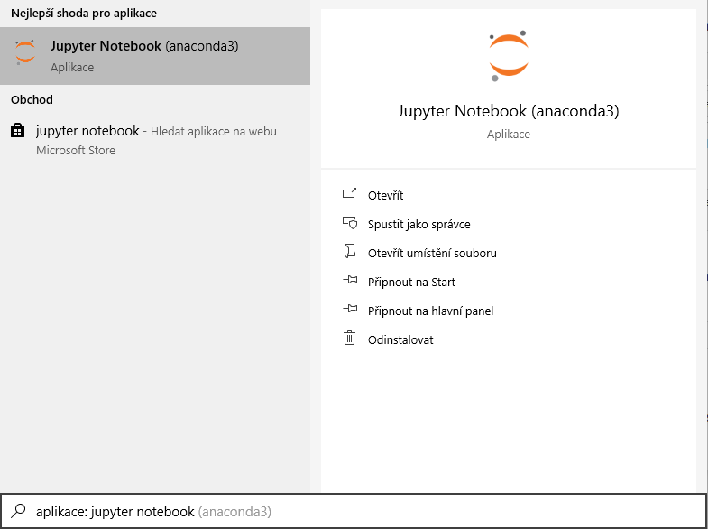

# WxTutorial
Tutorial obsahuje:
1. Instalace WxPythonu
2. Úvod do OOP
3. Základní práci s wx
4. Práci se základními objekty
5. Práce se sizery
6. Praktická část (názorné příklady)
7. Aplikace wxGlade

Repositář tutorialu si uložte a otevřete pomocí `Jupyter Notebook`.

### Instalace a spuštění Notebooku

Je mnoho způsobů, jak otevřít `Jupyter notebook`, který pracuje v prohlížeči. Můžete jej otevřít přímo na oficiálních [stránkách](https://jupyter.org/)
nebo si jej nainstalujete přímo do počítače skrze [pip](https://pypi.org/project/pip/)
v [příkazové řádce](https://wintip.cz/534-jak-spoustet-prikazovy-radek-klavesovou-zkratkou).

`pip install notebook`

Program se poté spouští v příkazovém řádku napsáním:

`jupyter notebook`

`Jupyter notebook` je též součástí programů instalace programů `Anaconda`, která vám vytvoří přímého zástupce nebo ho spustíte pomocí `Anadonca navigatoru`.

Windows 10:

Pokud při instalaci přes `pip` na **Windows** proběhla instalace úspěšně, ale v příkazovém řádku se program `Jupyter` nerozpoznává a vrací vám chybovou hlášku:

`'jupyter' is not recognized as an internal or external command, operable program or batch file`

Jedná se o chybu, kdy Windows nemůže najít cestu k systémové proměnné `Jupyteru` nebo konkrétně k samotnému `Pythonu`, kde je `Jupyter` nainstalován.
(jedná se většinou o špatně nastavenou `Path` pythonu ve vašem zařízení). Řešením je buď přenastavení 
[Path](https://geek-university.com/python/add-python-to-the-windows-path/), nebo můžete program spustit jednoduše upraveným příkazem:

`python -m notebook`

Po úspěšném spuštění by se vám měl zobrazit váš výchozí prohlížeč v uložišti, kde jste si `notebook` spustili. V průzkumínku souborů si najdeme stažený repositář, kde jsou lekce. Formát notebooku je `.ipynb`. Kliknutím na lekci ji otevřete na dalším panelu prohlížeče. Bližší ovládání `notebooku` naleznete v první lekci.
